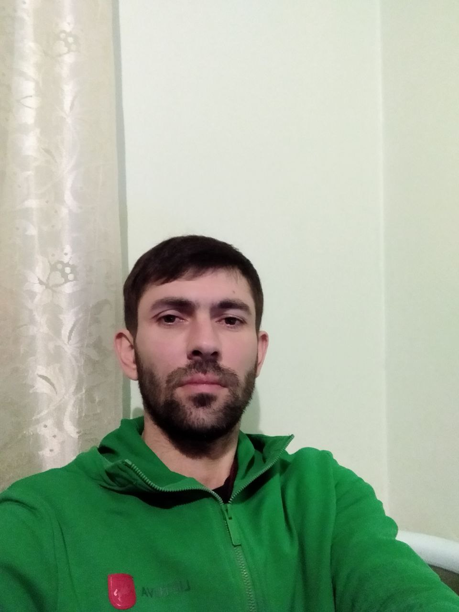

# My_rezume
# Resume

Name: Valerii Sidorchuk
Contact Information: mingaev.1984@gmail.com

Work Experience
Personal Projects (2021-2022)

- Developed various Python projects, including web applications, data analysis scripts, and automation tools.
- Implemented Python frameworks such as Flask and Django to build web applications.
- Utilized libraries like NumPy, Pandas, and Matplotlib for data manipulation and visualization.
- Practiced version control using Git and hosted projects on GitHub.
- Collaborated with other developers on open-source projects, contributing code and addressing issues.
- Continuously improved programming skills through self-study and online resources.
- Created Telegram and Instagram bots, voice assistants using chat bot APIs and Chat GPT.
- Developed my own website using Django.

Internship (Summer 2022)

- Assisted the development team in building and maintaining web applications using Django.
- Participated in code reviews, bug fixing, and feature enhancements.
- Worked closely with senior developers to learn best practices and improve coding skills.
- Contributed to the development of a new feature, implementing functionality and conducting testing.
- Collaborated with the team to meet project deadlines and deliver high-quality software.

Skills

- Python
- Frameworks: Django
- HTML5
- CSS3
- Databases: MySQL, PostgreSQL
- Git
- Docker
- Dialogflow

OS:
- Linux
- Windows

Projects

- [valerii1984.pythonanywhere.com](valerii1984.pythonanywhere.com)
- [https://t.me/Valerii_1_bot](https://t.me/Valerii_1_bot)

Education

- Kamianets-Podilskyi Ivan Ohiienko National University.

